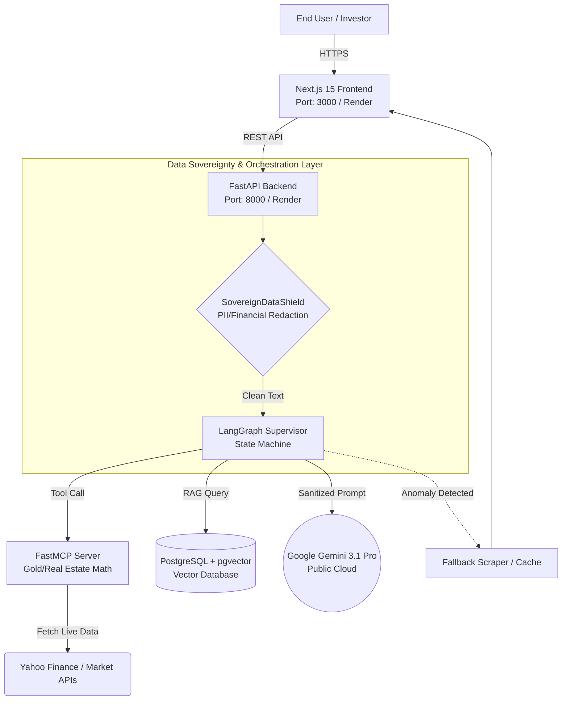

# Gold Analyst AI - Enterprise Architecture

## Overview
Gold Analyst AI is a proprietary sovereign artificial intelligence platform designed for the MENA region, providing decoupled AI reasoning, real-time market data, and precise premium calculations for Gold and Real Estate assets.

## Master Architecture Diagram

## System Design & Trade-offs

The Gold Analyst AI architecture was intentionally designed specifically for robust independent scalability and regulatory compliance:

1. **Decoupled Architecture**: The user interface (Next.js) is physically and logically separated from the AI reasoning engine (FastAPI). This allows us to scale the demanding AI inference backend independently of the lightweight frontend web traffic.
2. **Data Sovereignty Compliance (MENA)**: To comply with UAE/KSA data localization laws, a `SovereignDataShield` middleware layer was constructed. This intercepts and sanitizes personally identifiable information (PII) and exact capital figures prior to transmission to cloud LLMs.
3. **Latency vs. Security Trade-off**: The inclusion of regex-based redaction layers and the LangGraph multi-agent orchestration model inherently introduces marginal processing latency (~50ms - 150ms). We intentionally accept this architectural trade-off in exchange for enterprise-grade data security and absolute anomaly prevention (protecting users from erroneous black-swan market pricing).
